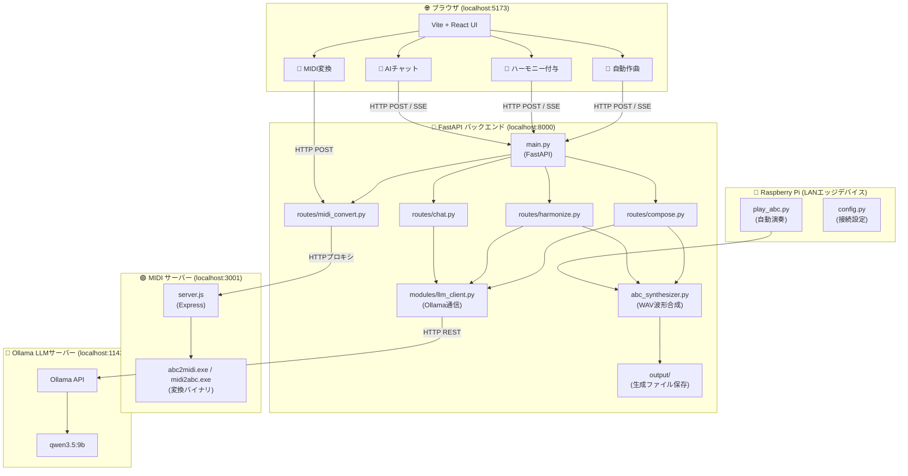

# ABC Music Suite

> **ローカルLLM (Ollama) を活用した、ABC記法による自動作曲・伴奏付与・MIDI変換・エッジ再生の統合システム**

[](https://opensource.org/licenses/MIT)
[](https://www.python.org/)
[](https://nodejs.org/)
[](https://ollama.com/)

**ABC Music Suite** は、ローカルマシン上の大規模言語モデル（Ollama/Qwen）と音声波形合成エンジン（abc2midi等）を組み合わせて、自然な音楽の作成・編集・再生を行う統合型音楽Suiteです。
完全ローカルで動作するため、外部APIキーは不要で、ランニングコストもかからず安全に動作します。

また、同じLAN内の **Raspberry Pi** と連携し、PC側の強力なGPUで音楽生成を行いながら、ラズパイに接続した物理スピーカーで自動演奏する「エッジ・ホスト協調構成」をサポートしています。

---

## 🌟 主な機能

| 機能 | 概要 |
|---|---|
| 🌌 **自動作曲** | 日本語でテーマ（例:「爽やかな朝の目覚め」）を入力すると、AIがABC記法の楽譜を生成し、自動でWAV音源に合成・再生します。 |
| 🎹 **ハーモニー付与** | 入力された単旋律（メロディライン）をAIが解析し、1オクターブ下のベース音を重ねたコード伴奏（二声）を自動生成します。 |
| 🔄 **MIDI ↔ ABC 相互変換** | C言語製の `abc2midi` および `midi2abc` 変換エンジンを使用し、MIDIファイルと楽譜テキスト（ABC記法）の双方向変換を行います。 |
| 💬 **AI 音楽チャット** | AIと音楽理論や作曲についてチャットしながら、回答内のABC記法を検知して自動的にその場で演奏を再生します（SSEストリーミング対応）。 |
| 🍓 **Raspberry Pi 演奏連携** | PCで生成した楽譜テキスト（ABC記法）をラズパイに同期し、スピーカーから物理再生（aplay使用）します。 |

---

## 🏗️ システムアーキテクチャ

本システムは、責務ごとに分割されたマルチレイヤー構成（疎結合設計）をとっています。



---

## 📂 ディレクトリ構成

```
情報科学演習/
├── server/                  # Python FastAPI バックエンド
│   ├── main.py              # サーバー起動用エントリポイント
│   ├── modules/
│   │   ├── config.py        # 統合設定ファイル (ポートやIP)
│   │   └── llm_client.py    # OllamaClient クラス (疎結合AI通信)
│   └── routes/              # 各APIエンドポイント実装
│
├── midi-server/             # Node.js MIDI 変換サーバー
│   ├── server.js            # Express API (abc2midi ラッパー)
│   └── abc2midi.exe         # 変換エンジンバイナリ
│
├── web-ui/                  # Vite + React フロントエンド
│   └── src/
│       ├── App.jsx          # UIレイアウト・状態管理
│       └── components/      # 各機能の画面タブ
│
├── raspberry/               # Raspberry Pi 用クライアント
│   ├── play_abc.py          # ローカルでABC楽譜ファイルを自動演奏
│   ├── test_connection.py  # PCのOllamaとの接続テストスクリプト
│   └── setup.sh             # ラズパイ環境構築スクリプト
│
├── docs/                    # 各種詳細ドキュメント・PDF
│   ├── ARCHITECTURE.md      # システム構成・アーキテクチャ詳細
│   ├── RASPBERRY_PI.md      # ラズパイ連携・セットアップ詳細
│   └── main.pdf             # 技術文書PDF (LaTeXビルド)
│
├── abc_synthesizer.py       # ABC記法からWAV音声を波形合成する共通モジュール
├── start.ps1                # ローカル全サービス一括起動スクリプト
└── start.bat                # Windows用ダブルクリック起動バッチ
```

---

## 🚀 クイックスタート

### 動作環境

- **Ollama**: インストール済みで、モデル（例: `qwen3.5:9b`）がダウンロードされていること。
- **Python**: 3.10以上
- **Node.js**: 18以上

### 1. 依存ライブラリのセットアップ

各ディレクトリで必要なパッケージをインストールします。

```powershell
# バックエンドパッケージ
cd server
pip install -r requirements.txt

# MIDIサーバーパッケージ
cd ../midi-server
npm install

# フロントエンドパッケージ
cd ../web-ui
npm install
```

### 2. システムの起動

Ollama が起動していることを確認した上で、ルートディレクトリにある一括起動スクリプトを実行します。

```powershell
# Windows PowerShell
.\start.ps1
```
または、`start.bat` をダブルクリックして起動します。

起動後、ブラウザで **`http://localhost:5173`** が自動的に開き、Web UIが利用可能になります。

---

## 🍓 Raspberry Pi 連携手順

Raspberry Pi から接続して自動演奏を行う場合は、以下の手順を実施します。

1.  **ホストPCのIPアドレスを確認**
    ```powershell
    ipconfig
    # (例: 10.98.145.83)
    ```
2.  **ラズパイへファイルの同期**
    PCのPowerShellから、ラズパイのIPを指定して転送スクリプトを実行します。
    ```powershell
    .\copy-to-pi.ps1 -PiIP <ラズパイのIPアドレス>
    ```
3.  **ラズパイ側での初期設定**
    SSHなどでラズパイに接続し、以下を実行します。
    ```bash
    cd ~/raspberry
    bash setup.sh
    source ~/.bashrc
    ```
4.  **動作テスト・演奏**
    PCとの接続疎通を確認し、ABC楽譜を演奏させます。
    ```bash
    # 接続確認
    llm-test

    # 楽譜ファイルの演奏
    play-abc sample.abc
    ```

---

## 📄 ライセンス

本システムは [MIT License](LICENSE) の下で公開されています。

詳細な設計情報、API仕様、トラブルシューティング等は、`docs/` ディレクトリ内の各Markdownドキュメントを参照してください。
