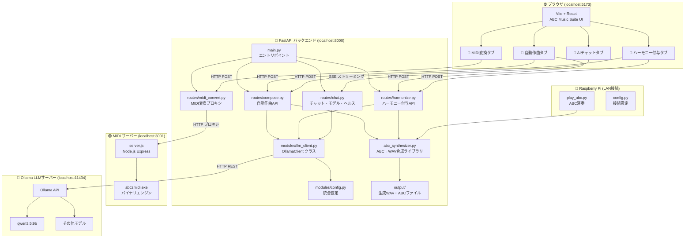
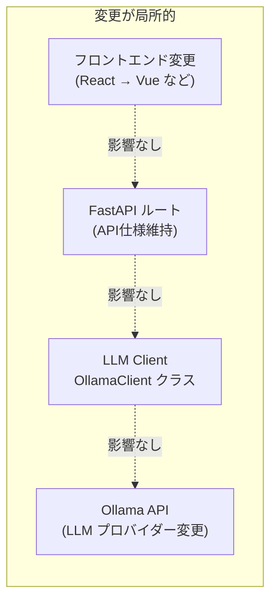
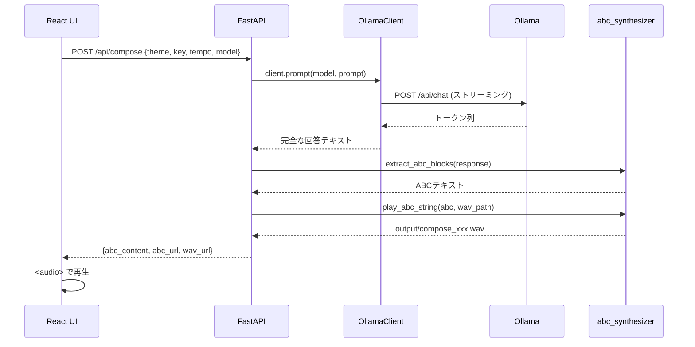
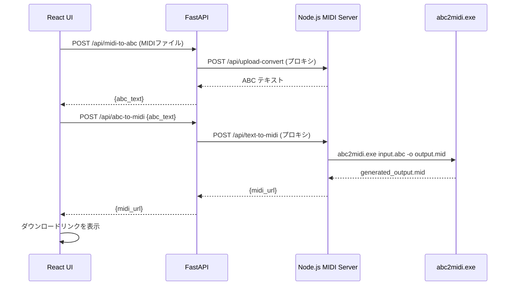
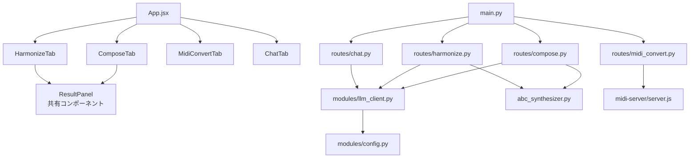

# ABC Music Suite - システム構成図

## 全体アーキテクチャ

---

## 疎結合の設計原則

各レイヤーはHTTP REST APIまたは関数インターフェースでのみ結合しているため：
- **LLMプロバイダーを変える** → `llm_client.py` だけ修正
- **Ollamaのホストを変える** → `config.py` の1行だけ修正
- **フロントエンドを全面刷新** → バックエンドは無変更
- **MIDI変換エンジンを変える** → `midi-server/server.js` だけ修正

---

## データフロー図

### 自動作曲フロー

### MIDI変換フロー

---

## ポート一覧

| サービス | ポート | プロトコル | 役割 |
|---|---|---|---|
| Vite Dev Server | 5173 | HTTP | React フロントエンド |
| FastAPI | 8000 | HTTP/SSE | バックエンドAPI |
| MIDI Server | 3001 | HTTP | abc2midi ラッパー |
| Ollama | 11434 | HTTP | LLM推論エンジン |

---

## モジュール依存関係

